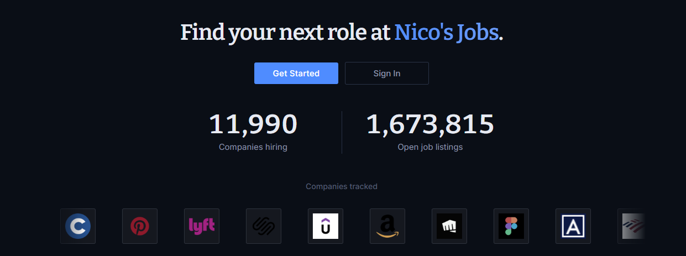
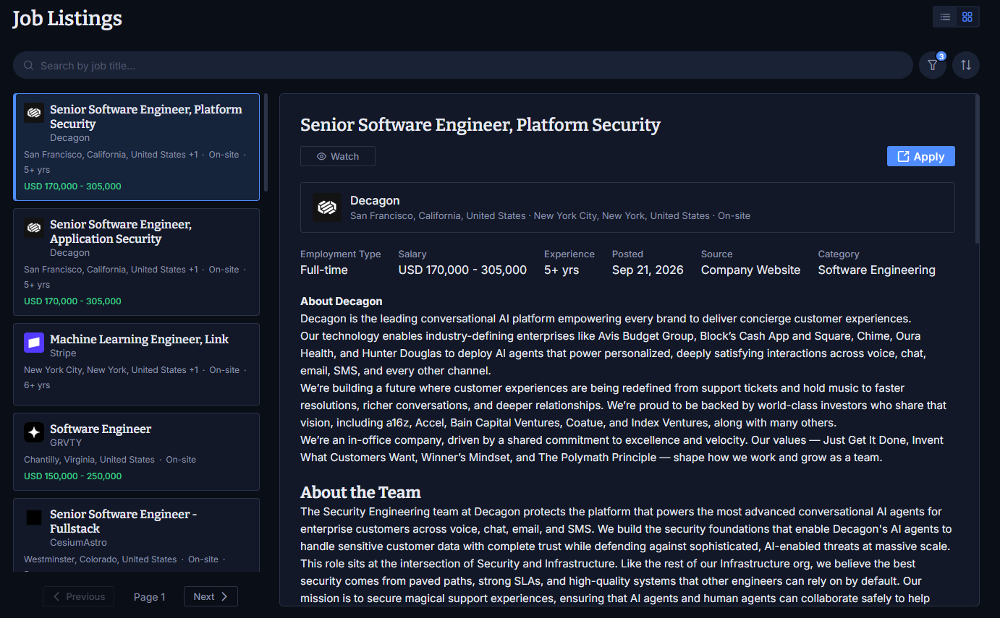
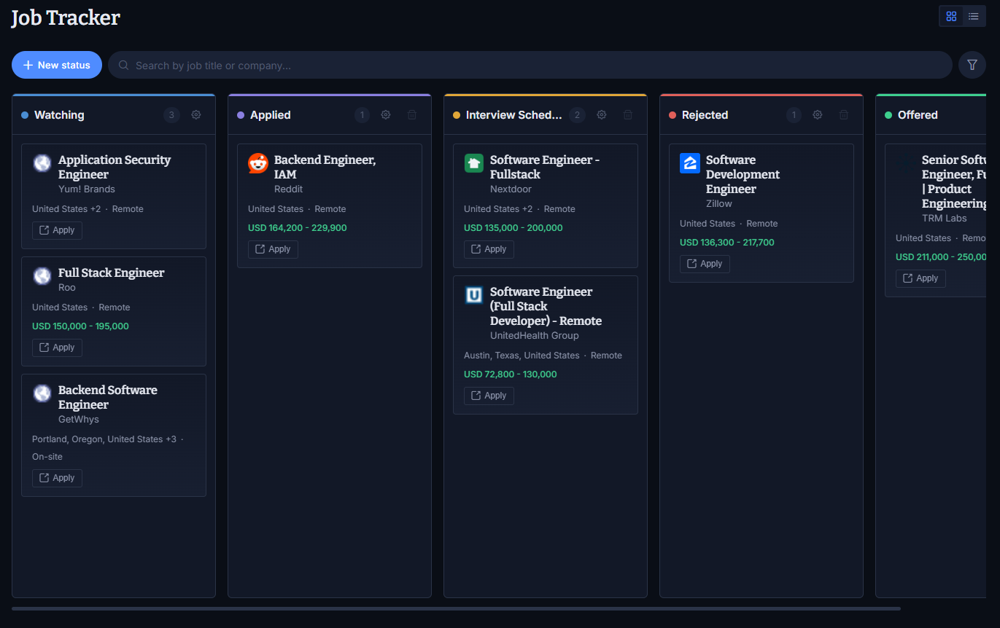
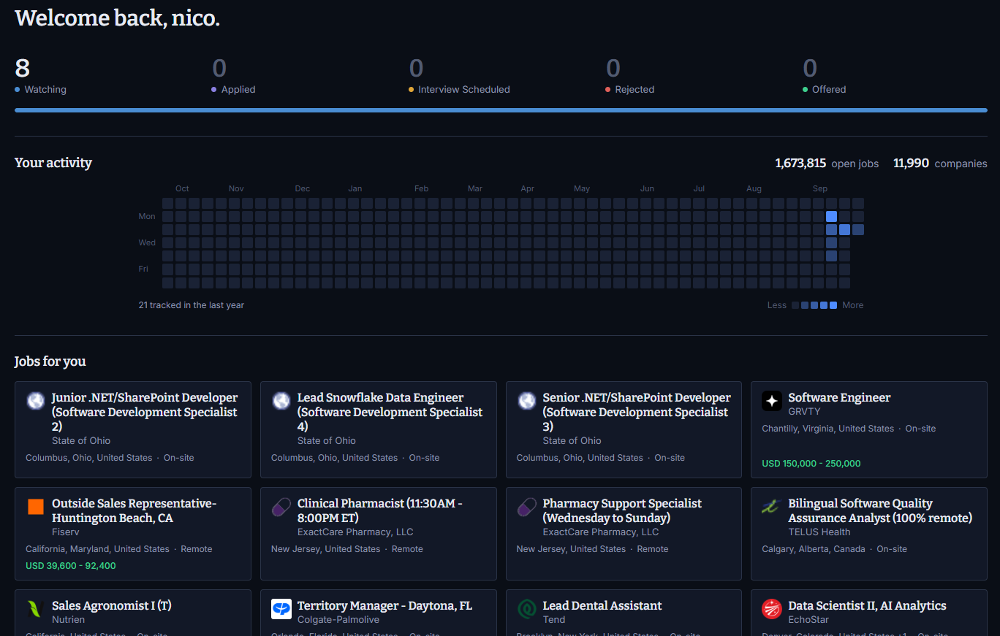

# Nico's Jobs

A job board that pulls listings straight from company career sites and gives you
one place to keep track of where you've applied.

## What it does

**Aggregates listings.** Scrapers run against tens of thousands of job postings
across company career pages — Workday, Greenhouse, Lever, Ashby, iCIMS and other
applicant tracking systems. Postings come from the source, so you're not reading
reposted or stale listings from a third-party aggregator.

**Search and filter.** Filter by title, category, workplace type (remote, hybrid,
on-site), employment type, salary range, location and experience level.

**Track your applications.** A kanban board where you move jobs through whatever
stages you want. Columns are yours to name and color, so the board matches how
you actually job hunt rather than a fixed pipeline. Save a listing from search
straight onto the board.

**See where you stand.** The dashboard counts your applications by stage, charts
your tracking activity over the past year, and surfaces recommended listings.

## Getting started

Register with an invite link, sign in, and start searching. Job listings and the
tracker both live behind login.
